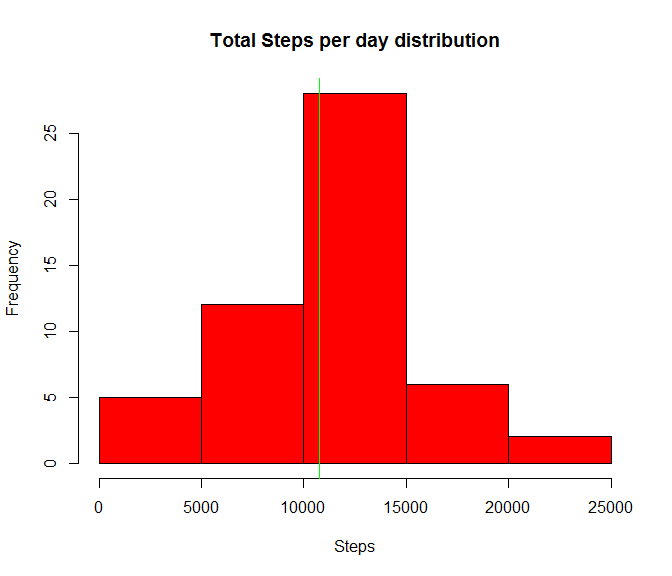
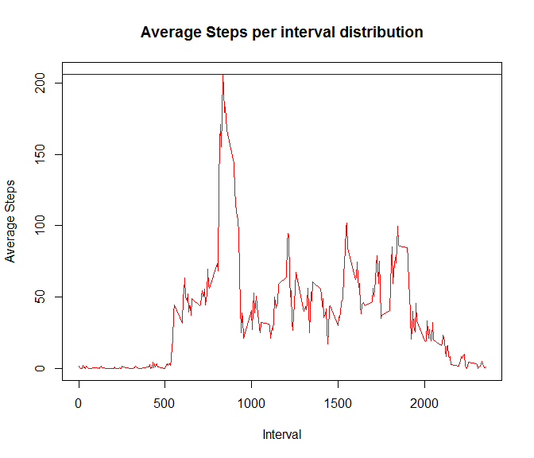
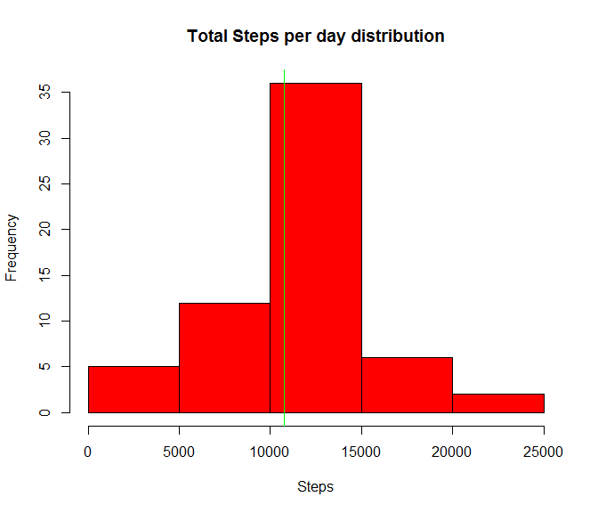
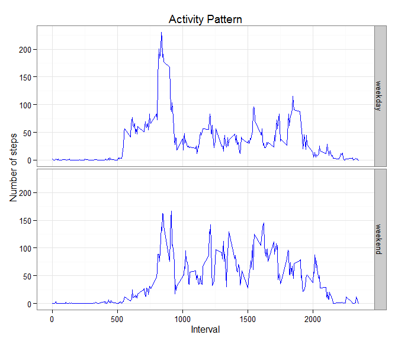

# Reproducible Research: Peer Assessment 1
##Introduction
This Analysis makes use of data from a personal activity monitoring
device such as a [Fitbit](http://www.fitbit.com), [Nike
Fuelband](http://www.nike.com/us/en_us/c/nikeplus-fuelband), or
[Jawbone Up](https://jawbone.com/up). This device collects data at 5 minute intervals through out the day. The data consists of two months of data from an anonymous
individual collected during the months of October and November, 2012
and include the number of steps taken in 5 minute intervals each day.
 
The dteails about the data for this analysis is given below.
 
* **Dataset**: [Activity monitoringdata](https://d396qusza40orc.cloudfront.net/repdata%2Fdata%2Factivity.zip) [52K]
 
The variables included in this dataset are:

* *steps*: Number of steps taking in a 5-minute interval (missing values are coded as `NA`)

* *date*: The date on which the measurement was taken in YYYY-MM-DD format

* *interval*: Identifier for the 5-minute interval in which measurement was taken
 
Once the data is downloaded from the [Dataset](https://d396qusza40orc.cloudfront.net/repdata%2Fdata%2Factivity.zip), place the zip file in the same working folder as this Script and using the *knit2html* function the PA1_template.html file will be created in the same folder as the script      

##Dependencies
The R code which does the analysis uses the functions from the following packages and the same need to be loaded to the environment. 


```r
library(lubridate)
library(dplyr)
library(ggplot2)
```

## Loading and preprocessing the data
 
### Loading the data:
Once the data file is downloaded, data is loaded in a *2 step* process

* *Step 1*: Unzip the downloaded dataset file

```r
unzip("repdata-data-activity.zip")
```
 
The actual dataset is stored in a comma-separated-value (activity.csv) file. 

* *Step 2*: Load the data to **R Environment**  

```r
Activity <- read.csv("activity.csv", na.strings = "NA", stringsAsFactors=FALSE)
```
 
There are a total of 17,568 observations of 3 variables in this dataset.
 
### Pre-processing the data:
Convert the Interval and Steps variables ad numeric and the date as Date. 

```r
Activity$date <- ymd(Activity$date)
Activity$steps <- as.numeric(Activity$steps)
Activity$interval <- as.numeric(Activity$interval)
```

## What is mean total number of steps taken per day?
In order to calculate the mean total number of steps, the following steps are performed 

**Step 1**: Calculate the total number of steps taken per day 
 

```r
TotalSteps <- Activity %>% group_by(date) %>% 
                summarise(steps = sum(steps))
```

**Step 2**: Plot a histogram on the TotalSteps 


```r
hist(TotalSteps$steps, xlab="Steps", 
     ylab="Frequency", col = "red", main = "Total Steps per day distribution") 
abline(v=mean(TotalSteps$steps, na.rm = TRUE),col="blue")
abline(v=quantile(TotalSteps$steps, na.rm = TRUE, probs = 0.5),col="green")
```

 

```r
meanTotalSteps <- mean(TotalSteps$steps, na.rm = TRUE)
medianTotalSteps <- quantile(TotalSteps$steps, na.rm = TRUE, probs = 0.5)
```
  
**Step 3**: Calculate the mean and median value
 
**The mean total number of steps taken per day is given below** 

```r
meanTotalSteps
```

```
## [1] 10766.19
```
 
 
**The median total number of steps taken per day is given below** 

```r
medianTotalSteps
```

```
##   50% 
## 10765
```

## What is the average daily activity pattern?
Following steps are performed to do this analysis

**Step 1**: Find the average steps  per interval and plot the time series chart

```r
AverageSteps <- Activity %>% group_by(interval) %>% 
                summarise(steps = mean(steps, na.rm=TRUE))
plot(AverageSteps$steps ~ AverageSteps$interval, main = "Average Steps per interval distribution",
     ylab="Average Steps", xlab= "Interval", type = "l", col="red") 
abline(h=max(AverageSteps$steps),col="blue")
```

 
  
**Step 2**: Calculate the interval with the max. number of steps

```r
MaxSteps <- AverageSteps %>% filter(steps == max(AverageSteps$steps))
```
  
**The interval which contains the maximum number of steps ( 206.1698113 ) is given below** 

```r
MaxSteps$interval
```

```
## [1] 835
```

## Imputing missing values
Following steps are performed to do this analysis
 
**Step 1**: Report the total number of Rows with missing values in the dataset 

```r
nrow(Activity) - nrow(Activity[complete.cases(Activity),])
```

```
## [1] 2304
```

 
**Step 2**: Fillout the missing values for each interval per day with the mean of that day  

```r
# Get the missing values in to a new list
MissingValues <- Activity[is.na(Activity$steps),]

# Find the unique intervals for which the values are missing
MissingValueIntervals <- unique(MissingValues$interval)

# Update the steps the missing values with the mean of the interval
CorrectedValues <- NULL
for (intcount in 1:length(MissingValueIntervals)) {
    
    # Fill out the missing steps for the interval with the mean step value for that interval
    CorrectedIntervalValues <- NULL
    CorrectedIntervalValues <- subset(MissingValues, interval == MissingValueIntervals[intcount])
    
    # Get the mean data for the selected Interval
    MeanData <-NULL
    MeanData <- subset(Activity, interval == MissingValueIntervals[intcount])
    
    # Update the missing values with the mean data
    CorrectedIntervalValues$steps <- mean(MeanData$steps, na.rm = TRUE)
    
    # Add the corrected date values to a new data frame
    CorrectedValues <- rbind(CorrectedValues, CorrectedIntervalValues)
}
```

**Step 3**: Create a new dataset that is equal to the original dataset but with the missing data filled in  

```r
UpdatedActivity <- rbind(Activity[is.na(Activity$steps) == FALSE,], CorrectedValues)
```

**Step 4**: Plot a histogram on the TotalSteps and calculate the mean and median with the new dataset 


```r
TotalSteps <- UpdatedActivity %>% group_by(date) %>% 
                summarise(steps = sum(steps))
```


```r
hist(TotalSteps$steps, xlab="Steps", 
     ylab="Frequency", col = "red", main = "Total Steps per day distribution") 
abline(v=mean(TotalSteps$steps, na.rm = TRUE),col="blue")
abline(v=quantile(TotalSteps$steps, na.rm = TRUE, probs = 0.5),col="green")
```

 

```r
meanTotalSteps <- mean(TotalSteps$steps, na.rm = TRUE)
medianTotalSteps <- quantile(TotalSteps$steps, na.rm = TRUE, probs = 0.5)
```
 
**The mean total number of steps taken per day with the updated dataset is given below** 

```r
meanTotalSteps
```

```
## [1] 10766.19
```
 
 
**The median total number of steps taken per day with the updated dataset is given below** 

```r
medianTotalSteps
```

```
##      50% 
## 10766.19
```

**After imputing the missing values with the mean value of the periods following changes are observed**   
1. Though the Mean() value remain the same compared to the first part, Median value got changed  
2. Mean and Median values remain the same
  
  
## Are there differences in activity patterns between weekdays and weekends?
Following steps are performed to do this analysis
 
**Step 1**: Create a new factor variable in the dataset with two levels - "weekday" and "weekend" indicating a given date is a weekday or weekend day 

```r
UpdatedActivity$day <- ifelse((weekdays(UpdatedActivity$date, abbreviate = TRUE) == "Sat") |
                                (weekdays(UpdatedActivity$date, abbreviate = TRUE) == "Sun"), 
                              "weekend", "weekday")
UpdatedActivity$day <- factor(UpdatedActivity$day, levels = c("weekday", "weekend"), 
                              labels = c("weekday", "weekend"))
```
  
**Step 2**: Make a panel plot containing a time series plot of the 5-minute interval and the average number of steps taken, averaged across all weekday days or weekend days


```r
AverageSteps <- UpdatedActivity %>% group_by(interval, day) %>% 
                summarise(steps = mean(steps, na.rm=TRUE))

g <- ggplot(AverageSteps, aes(x = interval, y = steps))
g + geom_line(color = "blue") +   facet_grid(day~.) +
  labs(title = "Activity Pattern") + 
  labs(x = "Interval", y = "Number of steps") + theme_bw ()
```

 
  
***Difference in the Activity Pattern for weekdays and weekend is shown in the chart above***
